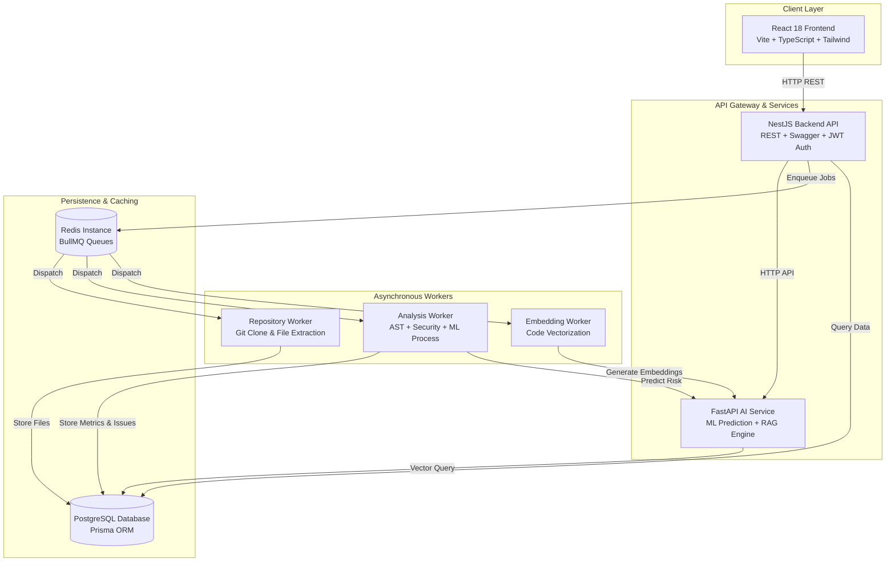
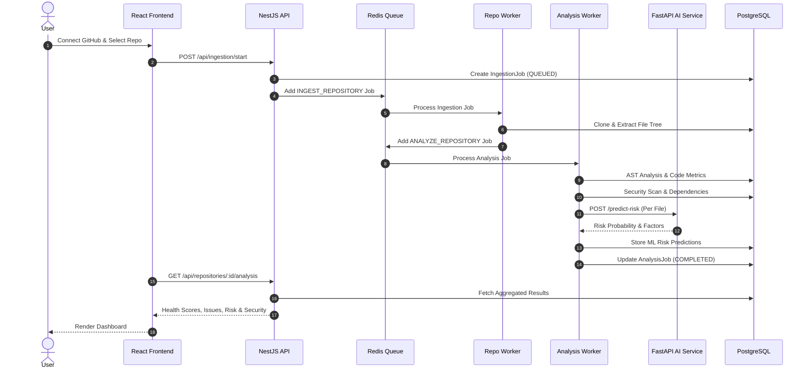
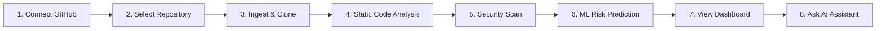
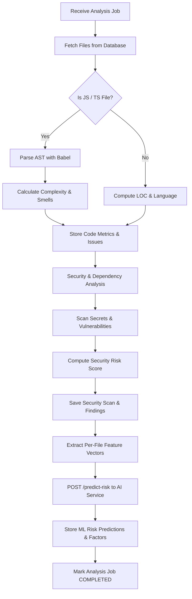
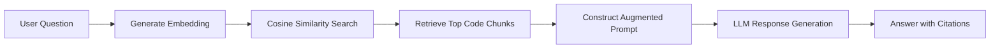
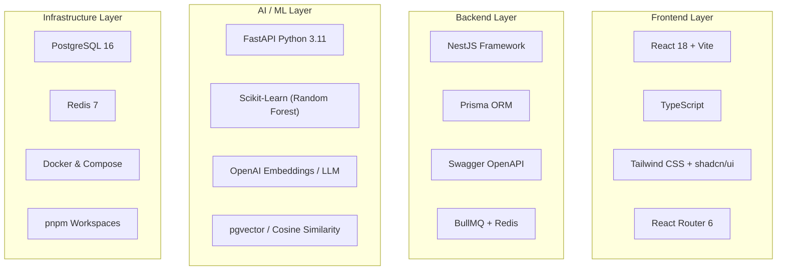
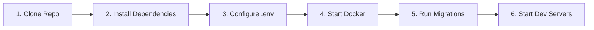
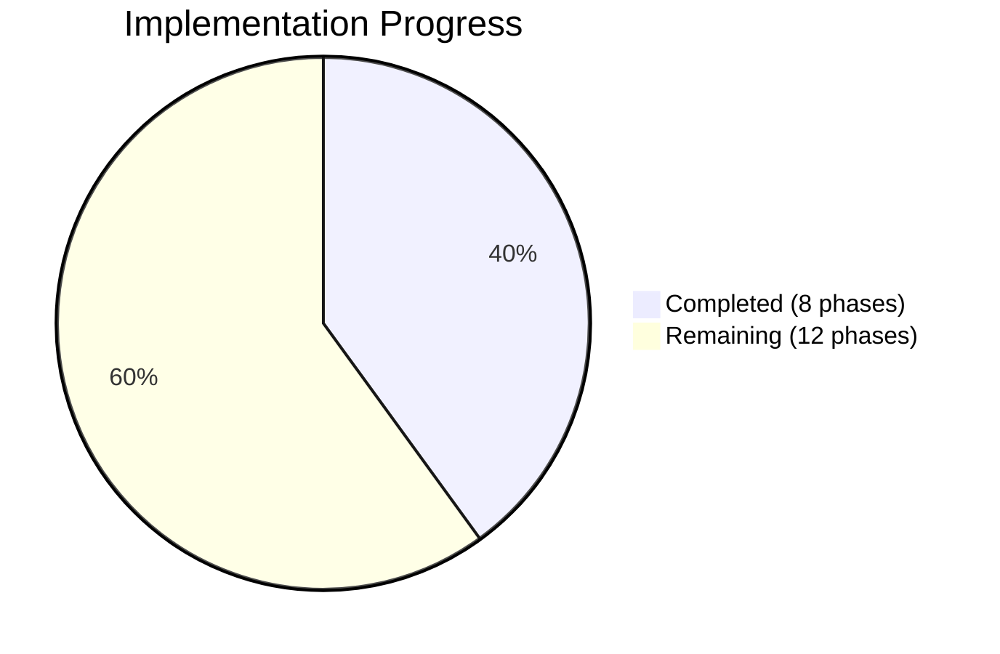
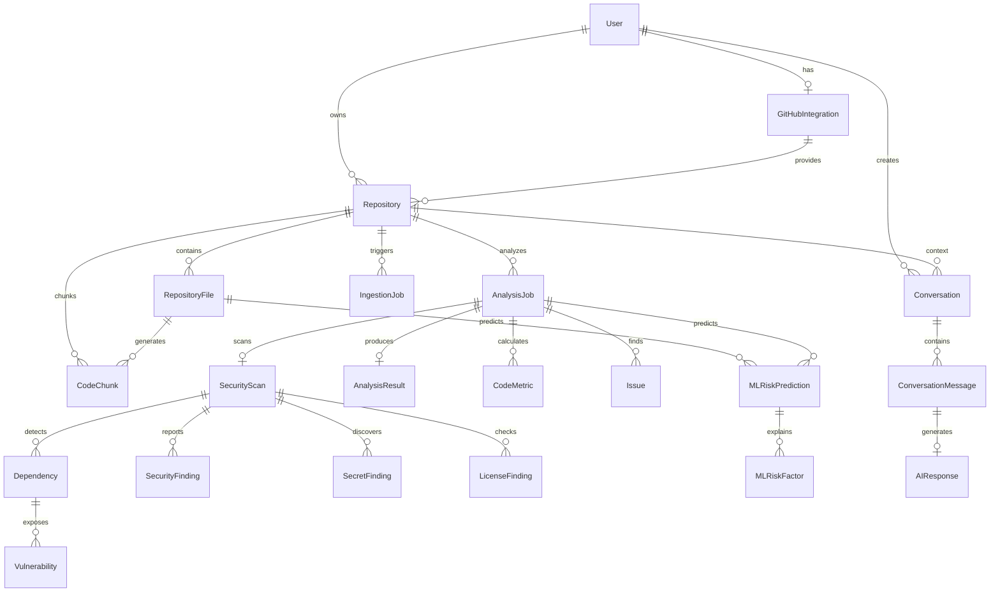
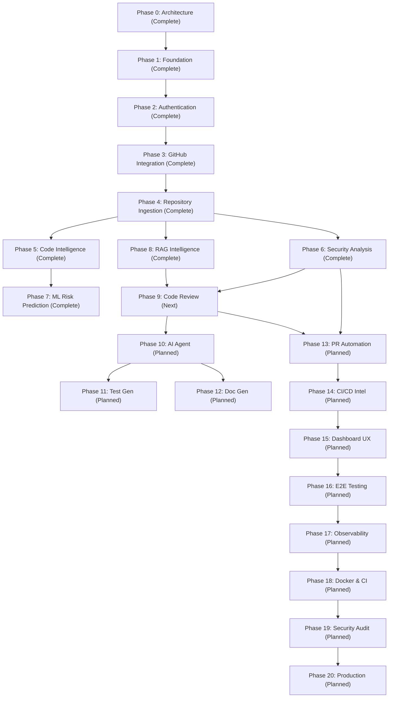

<div align="center">

# 🚀 DevCodeX64

### **AI-Powered Code Intelligence & DevSecOps Platform**

[](docs/ROADMAP.md)
[](docs/ARCHITECTURE.md)
[](docs/AI_ARCHITECTURE.md)
[](LICENSE)
[](https://www.typescriptlang.org/)
[](https://python.org)

> **Connect your GitHub repositories** → **Ingest & Analyze code** → **Detect security risks** → **Predict defects with ML** → **Ask AI about your codebase**

---

*A full-stack platform providing repository intelligence, code quality analysis, security scanning, ML-based risk prediction, RAG-powered AI assistant, and more — all in one unified developer experience.*

</div>

---

## 📋 Table of Contents

- [✨ Features](#-features)
- [🏗️ Architecture](#️-architecture)
- [🔄 How It Works](#-how-it-works)
- [🛠️ Technology Stack](#️-technology-stack)
- [⚡ Quick Start](#-quick-start)
- [🗂️ Repository Structure](#️-repository-structure)
- [🌐 Service URLs](#-service-urls)
- [💻 Development Commands](#-development-commands)
- [📊 Implementation Status](#-implementation-status)
- [📚 Documentation](#-documentation)
- [📄 License](#-license)

---

## ✨ Features

<table>
<tr>
<td width="50%">

### 🔐 Authentication & Security
- Email/password registration & login
- JWT access tokens (15 min) + refresh tokens (7 day)
- Bcrypt password hashing
- Protected route guards
- GitHub App OAuth integration

</td>
<td width="50%">

### 🔗 GitHub Integration
- GitHub App installation flow
- Repository listing via GitHub API
- Branch & commit browsing
- File tree & content retrieval
- Webhook endpoint setup

</td>
</tr>
<tr>
<td width="50%">

### 📥 Repository Ingestion
- BullMQ job queue architecture
- Automated git cloning (HTTPS)
- Recursive file tree extraction
- Smart file filtering (30+ extensions)
- Real-time job status tracking

</td>
<td width="50%">

### 🔍 Code Intelligence & Static Analysis
- AST-based code analysis (Babel parser)
- Cyclomatic complexity calculation
- Function & class extraction
- Code smell detection (long methods, large classes)
- LOC counting & language detection
- Health score algorithm (weighted sub-scores)

</td>
</tr>
<tr>
<td width="50%">

### 🛡️ Security & Dependency Analysis
- Secret detection (API keys, tokens, passwords)
- Dependency manifest parsing (package.json, requirements.txt)
- Vulnerability scanning (CVE matching)
- Code security scanning (SQL injection, path traversal, XSS)
- License compliance checking
- Weighted risk score (0–100)

</td>
<td width="50%">

### 🤖 ML Risk Prediction
- Random Forest classifier
- Per-file risk probability scoring
- Feature extraction pipeline (LOC, complexity, functions, security findings)
- Risk factor impact analysis
- Model versioning
- Clear prediction labeling

</td>
</tr>
<tr>
<td colspan="2" align="center">

### 🧠 RAG Repository Intelligence (AI Assistant)
- AST-aware code chunking pipeline
- Embedding generation (OpenAI-compatible)
- Cosine similarity vector retrieval
- Context-aware LLM response generation with source citations
- Prompt injection protection
- Conversation history with AI response metadata

</td>
</tr>
</table>

---

## 🏗️ Architecture

### High-Level System Architecture



### Service Communication Flow



---

## 🔄 How It Works

### End-to-End Analysis Pipeline



### Step-by-Step Workflow

| Step | Action | What Happens |
|:----:|--------|-------------|
| **1** | 🔗 **Connect GitHub** | Install the GitHub App on your account/org. DevCodeX64 stores the installation ID securely. |
| **2** | 📥 **Select Repository** | Browse your GitHub repos from the dashboard. Pick one to analyze. |
| **3** | ⚡ **Trigger Ingestion** | A BullMQ job is queued. The Repository Worker clones the repo via the GitHub API, extracts all source files (30+ extensions), and stores them in PostgreSQL. |
| **4** | 🔍 **Code Analysis** | The Analysis Worker parses each JS/TS file with Babel AST. It calculates cyclomatic complexity, extracts functions/classes, detects code smells (long methods, large classes), and computes LOC metrics. |
| **5** | 🛡️ **Security Scan** | In the same pipeline: secrets are detected via regex patterns, dependencies are parsed from manifest files, vulnerabilities are matched, and code security patterns (SQLi, XSS, path traversal) are scanned. A weighted risk score (0–100) is computed. |
| **6** | 🤖 **ML Risk Prediction** | For each file, features (LOC, complexity, functions, dependencies, code smells, security findings) are extracted and sent to the FastAPI ML service. A Random Forest model predicts risk probability and identifies top risk factors. |
| **7** | 📊 **View Results** | The React dashboard shows health scores, code metrics, security findings, vulnerability reports, dependency status, and per-file ML risk predictions — all in one unified view. |
| **8** | 🧠 **Ask AI Assistant** | Ask natural-language questions about your codebase. The RAG pipeline chunks code, generates embeddings, retrieves relevant context via cosine similarity, and produces LLM answers with source citations. |

---

### Analysis Worker Pipeline (Internal)



### RAG AI Assistant Pipeline



---

## 🛠️ Technology Stack



| Layer | Technology | Purpose |
|-------|-----------|---------|
| **Frontend** | React 18 + Vite + TypeScript + Tailwind CSS + shadcn/ui | Modern reactive UI with component library |
| **Backend** | NestJS + TypeScript + Prisma + Swagger | REST API with auto-generated docs |
| **AI/ML** | Python + FastAPI + Scikit-learn + pgvector | ML risk prediction & RAG pipeline |
| **Queue** | Redis + BullMQ | Async job processing for ingestion & analysis |
| **Database** | PostgreSQL + Prisma ORM | Relational data with vector embeddings |
| **DevOps** | Docker + Docker Compose + GitHub Actions | Containerized development & CI/CD |

---

## ⚡ Quick Start

### Prerequisites

| Tool | Required Version | Check Command |
|------|:---------------:|---------------|
| Node.js | `>= 20.0.0` | `node --version` |
| pnpm | `>= 9.0.0` | `pnpm --version` |
| Python | `>= 3.11` | `python --version` |
| Docker | `>= 24.0` | `docker --version` |
| Docker Compose | `>= 2.20` | `docker compose version` |

### Setup Steps



#### 1️⃣ Clone the repository
```bash
git clone https://github.com/sivaganesh7/DevCodeX64.git
cd DevCodeX64
```

#### 2️⃣ Install dependencies
```bash
npm install -g pnpm    # if not already installed
pnpm install
```

#### 3️⃣ Configure environment
```bash
cp .env.example .env
# Edit .env with your local settings (database URL, GitHub App credentials, AI API keys)
```

#### 4️⃣ Start infrastructure (PostgreSQL + Redis)
```bash
docker compose up -d
```

#### 5️⃣ Setup database
```bash
pnpm db:generate       # Generate Prisma client
pnpm db:migrate:dev    # Apply migrations
pnpm db:seed           # (Optional) Seed dev data
```

#### 6️⃣ Start all services
```bash
# Terminal 1 — NestJS API
pnpm --filter=@devcodex64/api dev

# Terminal 2 — React Frontend
pnpm --filter=@devcodex64/web dev

# Terminal 3 — AI Service (FastAPI)
cd apps/ai-service && uvicorn app.main:app --reload --port 8000

# Terminal 4 — Repository Worker
pnpm --filter=@devcodex64/repository-worker dev

# Terminal 5 — Analysis Worker
pnpm --filter=@devcodex64/analysis-worker dev
```

#### 7️⃣ Open your browser

| Service | URL |
|---------|-----|
| 🌐 Frontend | http://localhost:5173 |
| ⚙️ NestJS API | http://localhost:3001/api |
| 📖 API Docs (Swagger) | http://localhost:3001/api/docs |
| 🤖 AI Service | http://localhost:8000 |
| 📖 AI Docs | http://localhost:8000/docs |

#### 8️⃣ Verify everything is running
```bash
# API health check
curl http://localhost:3001/api/health

# AI service health check
curl http://localhost:8000/health
```

---

## 🗂️ Repository Structure

```
DevCodeX64/
├── 📦 apps/
│   ├── web/                    # React 18 + Vite frontend
│   │   └── src/
│   │       ├── app/            #   Router, providers, App shell
│   │       ├── components/     #   UI components, charts, layout, code-editor
│   │       ├── features/       #   Feature modules ↓
│   │       │   ├── auth/       #     Login & Register pages
│   │       │   ├── dashboard/  #     Main dashboard
│   │       │   ├── repositories/ #   Repo listing, details, overview, issues
│   │       │   ├── security/   #     Security overview, secrets, vulnerabilities
│   │       │   ├── dependencies/ #   Dependency management
│   │       │   ├── risk/       #     ML risk visualization
│   │       │   ├── analysis/   #     Analysis results
│   │       │   ├── assistant/  #     AI RAG assistant (placeholder)
│   │       │   ├── code-review/ #    Code review (placeholder)
│   │       │   ├── settings/   #     User settings
│   │       │   └── ...        #     More feature modules
│   │       ├── hooks/          #   Custom React hooks
│   │       ├── services/       #   API client services
│   │       └── lib/            #   Utilities
│   │
│   ├── api/                    # NestJS backend (port 3001)
│   │   └── src/
│   │       └── modules/
│   │           ├── auth/       #   Authentication (JWT, bcrypt)
│   │           ├── github/     #   GitHub App integration
│   │           ├── ingestion/  #   Repository ingestion queue
│   │           ├── analysis/   #   Analysis results API
│   │           ├── security/   #   Security scan API
│   │           ├── risk/       #   ML risk prediction API
│   │           ├── repositories/ # Repository CRUD
│   │           ├── health/     #   Health check endpoint
│   │           ├── webhooks/   #   GitHub webhook handler
│   │           ├── assistant/  #   RAG assistant module
│   │           ├── issues/     #   Code issues API
│   │           ├── dependencies/ # Dependency API
│   │           ├── jobs/       #   Job management
│   │           └── users/      #   User management
│   │
│   └── ai-service/             # FastAPI AI/ML service (port 8000)
│       └── app/
│           ├── api/routes/     #   risk, rag, embeddings, health endpoints
│           ├── ml/             #   ML pipeline (features, training, evaluation, prediction)
│           ├── core/           #   Database, embeddings, LLM, RAG, security
│           ├── features/       #   Feature engineering
│           ├── models/         #   Risk model
│           ├── schemas/        #   Pydantic schemas
│           └── services/       #   Business logic
│
├── ⚡ workers/
│   ├── repository-worker/      # BullMQ worker: git clone + file extraction
│   │   └── src/
│   │       ├── cloning/        #   Git clone logic
│   │       ├── ingestion/      #   File processing
│   │       └── processing/     #   Content extraction
│   │
│   ├── analysis-worker/        # BullMQ worker: code + security + ML analysis
│   │   └── src/
│   │       ├── code-analysis/  #   (Inline AST analysis in index.ts)
│   │       ├── security-analysis/ # Secret, vulnerability, code security scanners
│   │       ├── dependency-analysis/ # Dependency manifest parsing
│   │       ├── ml-risk/        #   ML risk processor (calls AI service)
│   │       └── metrics/        #   Metric calculations
│   │
│   └── embedding-worker/       # BullMQ worker: embedding generation (stub)
│
├── 📦 packages/
│   ├── types/                  # Shared TypeScript type definitions
│   ├── config/                 # Shared configuration
│   ├── validation/             # Shared Zod validation schemas
│   └── shared/                 # Shared utilities
│
├── 💾 database/
│   └── prisma/
│       ├── schema.prisma       # Complete schema (20+ models)
│       ├── migrations/         # Database migrations
│       └── seed.ts             # Development seed data
│
├── 📚 docs/                    # Architecture & specification documents
├── 🐳 infrastructure/          # Dockerfiles, CI/CD, nginx configs
├── 🧪 tests/                   # E2E, integration, security tests
└── 🤖 .agents/rules/           # AI agent engineering rules
```

---

## 🌐 Service URLs

| Service | URL | Status |
|---------|-----|:------:|
| 🌐 Frontend | http://localhost:5173 | ✅ Active |
| ⚙️ NestJS API | http://localhost:3001/api | ✅ Active |
| 📖 Swagger Docs | http://localhost:3001/api/docs | ✅ Active |
| 🤖 AI Service | http://localhost:8000 | ✅ Active |
| 📖 AI Docs | http://localhost:8000/docs | ✅ Active |
| ❤️ API Health | http://localhost:3001/api/health | ✅ Active |
| ❤️ AI Health | http://localhost:8000/health | ✅ Active |
| 💾 PostgreSQL | localhost:5432 | ✅ Active |
| 📮 Redis | localhost:6379 | ✅ Active |

---

## 💻 Development Commands

| Command | Description |
|---------|-------------|
| `pnpm dev` | Start Node.js services in parallel |
| `pnpm test` | Run all tests |
| `pnpm lint` | Lint all TypeScript packages |
| `pnpm typecheck` | Type-check all TypeScript packages |
| `pnpm build` | Build all packages |
| `pnpm db:generate` | Generate Prisma client |
| `pnpm db:migrate:dev` | Create and apply database migration |
| `pnpm db:seed` | Seed development database |
| `pnpm db:studio` | Open Prisma Studio (GUI) |
| `pnpm docker:up` | Start Docker services (`docker compose up -d`) |
| `pnpm docker:down` | Stop Docker services (`docker compose down`) |

---

## 📊 Implementation Status

### Progress Overview



### Database Schema Coverage



### Detailed Phase Status

| Phase | Description | Status | Key Deliverables |
|:-----:|-------------|:------:|------------------|
| **0** | Requirements + Architecture | ✅ **Complete** | MASTER_SPEC, ARCHITECTURE, DATABASE, API_SPEC, AI_ARCHITECTURE, SECURITY, TESTING, ROADMAP, DECISIONS docs |
| **1** | Monorepo + Foundation | ✅ **Complete** | pnpm workspace, React + NestJS + FastAPI apps, Docker Compose, Prisma schema, health endpoints |
| **2** | Authentication + Authorization | ✅ **Complete** | Register/Login, JWT tokens, bcrypt hashing, protected routes, auth guards |
| **3** | GitHub Integration | ✅ **Complete** | GitHub App flow, repo listing, branch/commit browsing, file tree/content, webhook setup |
| **4** | Repository Ingestion | ✅ **Complete** | BullMQ queue, repository worker, git cloning, file extraction, job status tracking |
| **5** | Code Intelligence + Static Analysis | ✅ **Complete** | Babel AST parsing, cyclomatic complexity, function/class extraction, code smells, health scores |
| **6** | Security + Dependency Analysis | ✅ **Complete** | Secret scanning, dependency parsing, vulnerability detection, code security patterns, risk scoring |
| **7** | ML Risk Prediction | ✅ **Complete** | Feature extraction, Random Forest model, risk probability, risk factors, model versioning |
| **8** | RAG Repository Intelligence | ✅ **Complete** | Code chunking, embedding generation, cosine similarity retrieval, LLM response, conversation storage |
| **9** | Intelligent Code Review | 🔄 **Next** | AI-powered file & PR code review |
| **10** | AI Engineering Agent | ⏳ Planned | ReAct loop agent orchestrator with tool registry |
| **11** | Test Generation + Execution | ⏳ Planned | Automated test generation with sandboxed execution |
| **12** | Documentation Generation | ⏳ Planned | README, API docs, function docs generation |
| **13** | PR Intelligence + Automation | ⏳ Planned | Auto PR analysis, AI review as GitHub comments |
| **14** | CI/CD Intelligence | ⏳ Planned | Pipeline health metrics, failure trend analysis |
| **15** | Dashboard + UX Refinement | ⏳ Planned | Responsive polish, accessibility, empty/loading/error states |
| **16** | Integration + E2E Testing | ⏳ Planned | Playwright E2E suite, full flow coverage |
| **17** | Observability | ⏳ Planned | Structured logging, request tracing, monitoring |
| **18** | Docker + CI/CD Pipeline | ⏳ Planned | Production Dockerfiles, GitHub Actions CI |
| **19** | Security Audit | ⏳ Planned | Penetration testing, dependency audits |
| **20** | Production Readiness | ⏳ Planned | Final audit, deployment docs, demo guide |

### Phase Dependency Graph



---

## 📚 Documentation

All architecture, API, database, and AI documentation lives in `docs/`:

| Document | Description |
|----------|-------------|
| [MASTER_SPEC.md](docs/MASTER_SPEC.md) | Complete project specification |
| [ARCHITECTURE.md](docs/ARCHITECTURE.md) | System architecture & design decisions |
| [DATABASE.md](docs/DATABASE.md) | Database schema design & ERD |
| [API_SPEC.md](docs/API_SPEC.md) | REST API specification & endpoints |
| [AI_ARCHITECTURE.md](docs/AI_ARCHITECTURE.md) | AI/ML architecture, models, RAG pipeline |
| [SECURITY.md](docs/SECURITY.md) | Security architecture & threat model |
| [TESTING.md](docs/TESTING.md) | Testing strategy & coverage targets |
| [ROADMAP.md](docs/ROADMAP.md) | Implementation roadmap & phase details |
| [DECISIONS.md](docs/DECISIONS.md) | Architecture decision log (ADRs) |

---

## 🏗️ API Overview

### NestJS REST API (port 3001)

| Method | Endpoint | Phase | Description |
|:------:|----------|:-----:|-------------|
| `GET` | `/api/health` | 1 | System health check |
| `POST` | `/api/auth/register` | 2 | User registration |
| `POST` | `/api/auth/login` | 2 | User login (JWT) |
| `GET` | `/api/auth/me` | 2 | Current user profile |
| `GET` | `/api/github/repositories` | 3 | List GitHub repos |
| `GET` | `/api/github/repositories/:name/branches` | 3 | List branches |
| `POST` | `/api/github/connect` | 3 | Connect GitHub App |
| `DELETE` | `/api/github/disconnect` | 3 | Disconnect GitHub |
| `POST` | `/api/ingestion/start` | 4 | Start repo ingestion |
| `GET` | `/api/ingestion/jobs/:id` | 4 | Get job status |
| `GET` | `/api/repositories/:id/analysis/latest` | 5 | Latest analysis results |
| `GET` | `/api/repositories/:id/metrics` | 5 | Code metrics |
| `GET` | `/api/repositories/:id/issues` | 5 | Code issues |
| `GET` | `/api/repositories/:id/security` | 6 | Security scan results |
| `GET` | `/api/repositories/:id/dependencies` | 6 | Dependencies list |
| `GET` | `/api/repositories/:id/risk` | 7 | ML risk predictions |

### FastAPI AI Service (port 8000)

| Method | Endpoint | Phase | Description |
|:------:|----------|:-----:|-------------|
| `GET` | `/health` | 1 | AI service health |
| `POST` | `/predict-risk` | 7 | ML risk prediction |
| `POST` | `/rag/query` | 8 | RAG question answering |
| `POST` | `/embeddings/generate` | 8 | Generate embeddings |

---

## 📄 License

MIT — See [LICENSE](LICENSE) for details.

---

<div align="center">

**Built with ❤️ by [Sivaganesh](https://github.com/sivaganesh7)**

*DevCodeX64 — Making code intelligence accessible to every developer.*

</div>
